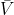
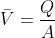
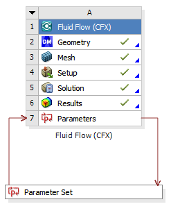
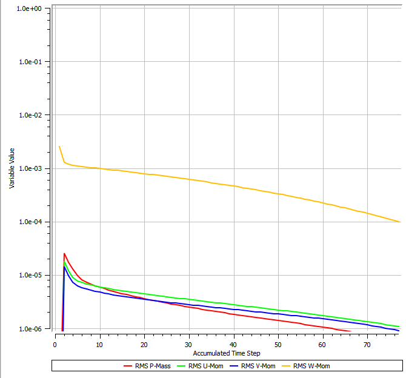
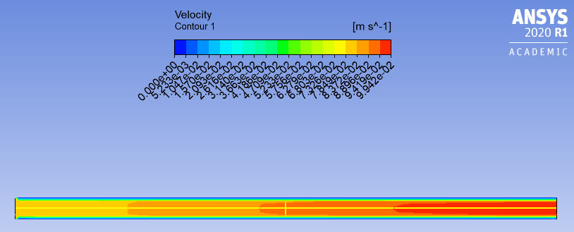
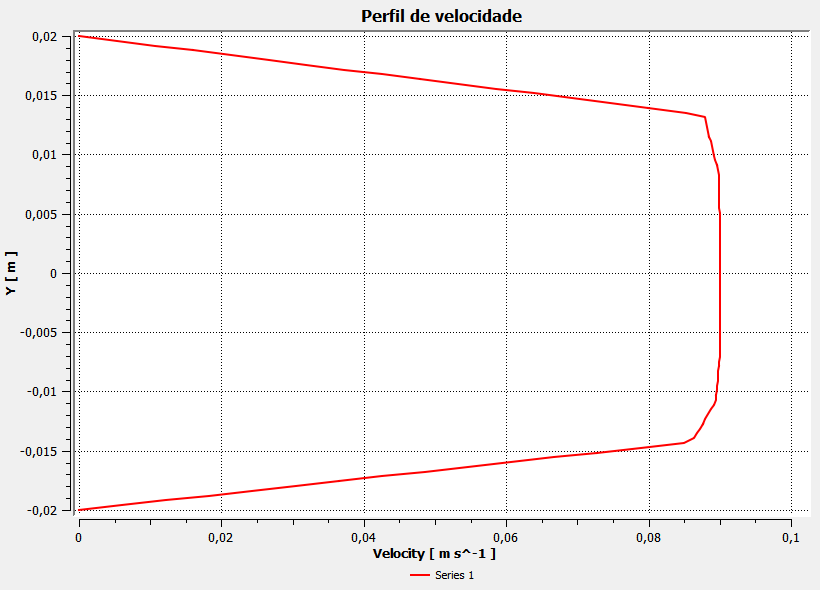
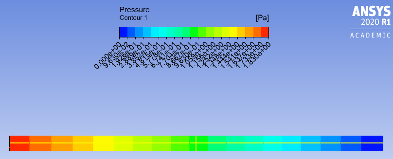
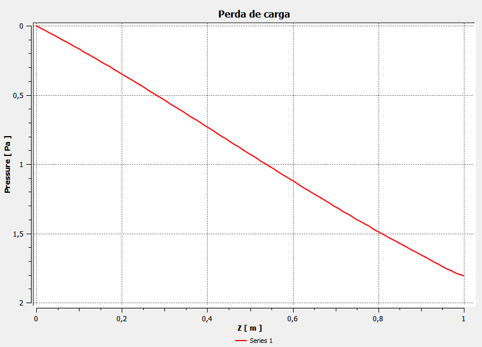

# 1.Introdução 

# 2. Objetivos 

  O objetivo geral do projeto é a análise da variação da pressão com a variação do comprimento do tubo. Comparando os dados obtidos na simulação e os dados obtidos pelos cálculos teóricos usando as informações fornecidas no enunciado.

## 2.1 Objetivos específicos 

Os objetivos específicos são

•	validação das informações apresentadas no enunciado

•	caso incorretas, apresentar possíveis problemas na tubulação

# 3. Metodologia

A metodologia aplicada para a realização do projeto foi

1.  Determinação de simplificações e parâmetros iniciais (modelagem do problema)

2.	Simulação do escoamento em um tubo, no CFX

3.	Cálculos teóricos utilizando a solução da equação de Navier-Stokes

4.	Comparação entre os dados da simulação e os cálculos

5.	Apresentação dos possíveis problemas na tubulação

# 4. Desenvolvimento 

Os resultados do projeto são obtidos de duas maneiras distintas: cálculos teóricos e simulação. Esses resultados são explanados abaixo. 

## 4.1 Cálculos teóricos 

Os resultados teóricos são obtidos por meio da aplicação de uma das soluções da equação de Navier-Stokes, com a qual é possível o cálculo da variação de pressão.

Para a determinação da velocidade  foi necessária a aplicação da fórmula

A qual determina a velocidade de escoamento do fluido a partir da vazão.

Para a análise do problema foram usados 6 tamanhos de tubulação sendo um dos tamanhos o descrito na introdução e os outros foram escolhidos de forma arbitrária para que fosse possível uma comparação entre os resultados.

Tamanho (m) | Variação de pressão calculada (Pa)
-----------:|-----------------------------------:
0.50        |0.796
0.75        |1.194
1.00        |1.592
1.25        |1.99
1.50        |2.388
2.00        |3.184

## 4.2 Simulação 

A simulação foi feita no Fluid Flow (CFX) do Ansys. Essa simulação segue a árvore de trabalho abaixo. 

Essa árvore de trabalho apresenta as etapas a serem seguidas para o desenvolvimento do projeto. Estas etapas são elucidadas abaixo.  

### a. Geometria 

A geometria do projeto é simples, sendo um tubo sem conexões ou detalhes, com um comprimento de 1m e um diâmetro de 40mm.

### b. Malha 

A malha foi gerada de forma automática, tendo em vista a simplicidade da geometria que possibilita o uso de uma malha que não seja tão refinada. 

### c. Setup

Nessa etapa é feita a configuração dos parâmetros que vão nortear a simulação realizada. Esses parâmetros são 

- a água como fluido de escoamento

- a velocidade na entrada como 0.0796 m/s

- a pressão relativa na saída como 0 Pa

- a definição de que o escoamento é laminar e a ausência de transferência de calor com o meio

- a manutenção dos parâmetros configurados automaticamente

### d. Solução 

Nessa etapa é verificada a convergência do problema, que se dá quando as curvas geradas no gráfico apontam para uma mesma direção, no caso do problema analisado todas as curvas apontam pra baixo validando a convergência do problema.Para a realização da simulação foram levados 21.887 segundos. 

### e. Resultados

Com a etapa da solução concluída, são gerados os resultados qualitativos da simulação os quais avaliam a pressão e a velocidade gerando gráficos e contornos.

#### i. Velocidade

No contorno de velocidade é observado que a velocidade é maior no centro do tubo, havendo uma evolução na velocidade da entrada até a saída, enquanto a velocidade nas paredes é menor.

No contorno de velocidade é observado que a velocidade é maior no centro do tubo, havendo uma evolução na velocidade da entrada até a saída, enquanto a velocidade nas paredes é menor.

#### ii. Pressão

No contorno de pressão é visto que a pressão aumenta na direção da saída do fluido.

 

Já no gráfico de perda de carga a curva gerada é uma linha descendente, o que é coerente com o comportamento esperado.

### f. Parâmetros

Na etapa dos parâmetros, são acrescidas informações as outras etapas que permitem o cálculo da variação de pressão da simulação já realizada. Com a implementação de uma equação na etapa dos resultados para o cálculo da variação da pressão foi possível chegar aos seguintes resultados.

Tamanho (m) | Variação de pressão simulada (Pa)
-----------:|-----------------------------------:
0.50        |0.8815
0.75        |1.2213
1.00        |1.8221
1.25        |1.4776
1.50        |2.8797
2.00        |3.7592

# 5. Discussão dos resultados 

# 6. Conclusão 

  Neste projeto foi feita uma análise da variação da pressão com a variação do comprimento do tubo. Essa análise foi feita por meio da comparação dos resultados obtidos por meio de cálculos teóricos e por meio da simulação. Com os resultados obtidos para o comprimento de 1m foi observado que a simulação corrobora o enunciado. Entretanto os resultados obtidos não são coerentes com os cálculos realizados, sendo assim a tubulação apresenta problemas.
  
  Dessa forma foram enunciados possíveis problemas para essa diferença entre os resultados. A principal hipótese levantada é o comprimento incorreto da tubulação e a partir disso foi comprovado o problema na tubulação, tendo em vista que no comprimento de 0.75m os resultados encontrados de ambos os modos é 1.22 Pa.

