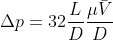

# 1.Introdução 

# 2. Objetivos 

  O objetivo geral do projeto é a análise da variação da pressão com a variação do comprimento do tubo. Comparando os dados obtidos na simulação e os dados obtidos pelos cálculos teóricos usando as informações fornecidas no enunciado.

## 2.1 Objetivos específicos 

Os objetivos específicos são

•	validação das informações apresentadas no enunciado

•	caso incorretas, apresentar possíveis problemas na tubulação

# 3. Metodologia

A metodologia aplicada para a realização do projeto foi

1.	Simulação do escoamento em um tubo, no CFX

2.	Cálculos teóricos utilizando a solução da equação de Navier-Stokes

3.	Comparação entre os dados da simulação e os cálculos

4.	Apresentação dos possíveis problemas na tubulação

# 4. Desenvolvimento 

Os resultados do projeto são obtidos de duas maneiras distintas: cálculos teóricos e simulação. Esses resultados são explanados abaixo. 

## 4.1 Cálculos teóricos 

Os resultados teóricos são obtidos por meio da aplicação de uma das soluções da equação de Navier-Stokes, com a qual é possível o cálculo da variação de pressão.

Para a análise do problema foram usados 6 tamanhos de tubulação sendo um dos tamanhos o descrito na introdução e os outros foram escolhidos de forma arbitrária para que fosse possível uma comparação entre os resultados.

Tamanho (m) | Variação de pressão calculada (Pa)
-----------:|-----------------------------------:
0.50        |0.796
0.75        |1.194
1.00        |1.592
1.25        |1.99
1.50        |2.388
2.00        |3.184

## 4.2 Simulação 

# 5. Discussão dos resultados 

# 6. Conclusão 

  Neste projeto foi feita uma análise da variação da pressão com a variação do comprimento do tubo. Essa análise foi feita por meio da comparação dos resultados obtidos por meio de cálculos teóricos e por meio da simulação. Com os resultados obtidos para o comprimento de 1m foi observado que a simulação corrobora o enunciado. Entretanto os resultados obtidos não são coerentes com os cálculos realizados, sendo assim a tubulação apresenta problemas.
  
  Dessa forma foram enunciados possíveis problemas para essa diferença entre os resultados. A principal hipótese levantada é o comprimento incorreto da tubulação e a partir disso foi comprovado o problema na tubulação, tendo em vista que no comprimento de 0.75m os resultados encontrados de ambos os modos é 1.22 Pa.

