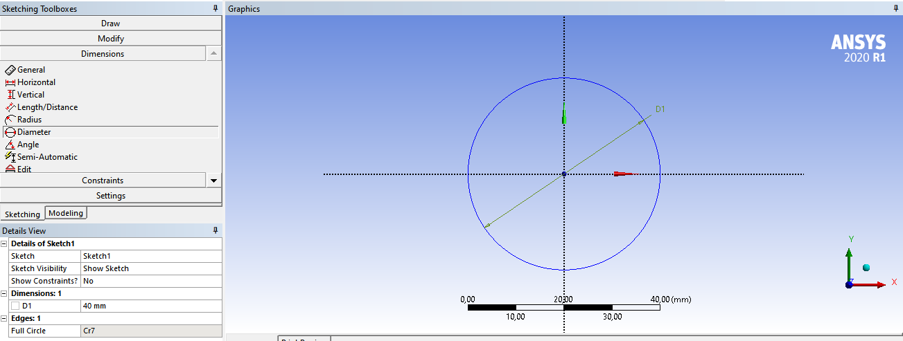
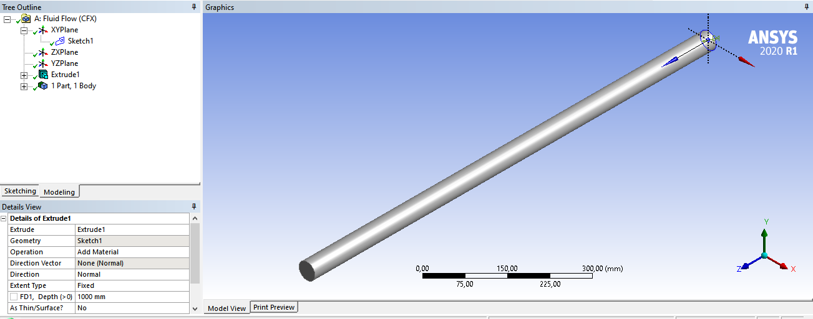
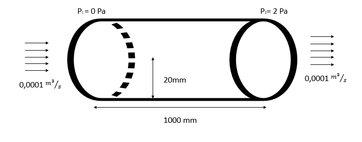

# Ludmilla Oliveira---16/0013348

Problema 1 - substituir a nota do laboratório

Problema 1: Uma instalação de bombeamento tem apresentado problemas em uma seção de tubulação de 1 metro de comprimento e 40 mm de diâmetro. A perda de carga foi medida usando sensores de pressão, e mensurou-se uma queda de pressão de 2 Pa. A bomba que supre esta tubulação com água está operando em potência máxima. Também mediu-se a vazão deste escoamento, obtendo um valor de 0,0001 metro cúbico por segundo na saída do tubo. O projeto de CFD deve:

- Determinar se estes valores de vazão e perda de carga estão coerentes ou não, e o motivo para isto.
- Apresentar possibilidades de problemas em caso dos valores colocados acima não estarem coerentes.
- Usando a simulação apresentada, realizar um estudo paramétrico do comprimento do tubo para avaliar se o cenário acima é normal ou não para esta instalação.

# Modelagem

## Perguntas

### Objetivo

O objetivo desse projeto é a análise da perda de carga em um cano de 40mm de diâmetro variando o seu comprimento, realizando assim comparações com cálculos feitos a partir da Equação de Bernoulli para a verificação da coerência dos dados obtidos via software.

#### Objetivos específicos 

Os objetivos específicos são a validação das informações apresentadas para vazão e perda de carga, e caso sejam incoerentes apresentar possibilidades para tal, e a partir da validação o prosseguimento para o objetivo geral. 

### Requisitos de solução

Para o problema proposto é a variação da perda de carga com o comprimento de um cano de 40mm de diâmetro, e caso não seja possivel a análise que seja indicado o meio para que ela seja feita.

### Finalidade do projeto

O projeto possui uma finalidade acadêmica, a qual é contituida pela avaliação da perda de carga de um cano, de acordo com a mudança do seu tamanho e a verificação da veracidade dos resultados obtidos 

### Possíveis hipóteses de simplificação

Uma hipotése que pode ser considerada é a de que a pressão relativa na entrada do cano seja igual a 0 Pa, o que facilitaria os cálculos para a verificação da perda de carga de 2 Pa. Outras possíveis siplificações são:

- Não existencia de flanges 
- Possui expessura regular  
- É composto somente por um material 

### Hipóteses de simplificação necessárias

Para uma melhor decorrência do projeto é necessário que sejam consideradas que o escoamento seja laminar e que não haja troca de calor com o meio, ou seja, esteja em um ambiente isolado 

### Precisão dos resultados obtidos

A precisão dos resultados seria de 3 casas decimais para ser possível cálculos precisos de forma análitica também

### Prazo de entrega do projeto

O prazo estipulado inicialmente é de 40 dias, sendo eles descriminados da seguinte forma 

- 10 dias para a modelagem 
- 15 dias para o pré-processamento 
- 15 dias para o processamento e pós-processamento

### Metodologias possíveis para o desenvolvimento do projeto

Para o caso apresentado, a melhor metodologia para a solução do problema é o CFD, tendo em vista que essa metodologia combina técnicas de cálculo numérico e dinâmica dos fluidos para a resolução de problemas de análise de escoamento e suas possíveis váriaveis.

---

## Projeto/Imagens

### Geometria do projeto

Figura 1 - imagem da base do cano com 40mm de diâmetro

 
Figura 2 - imagem do cano em seu comprimento, com 1m

### Esquemático da modelagem

Figura 3 - representação esquemática do problema 
