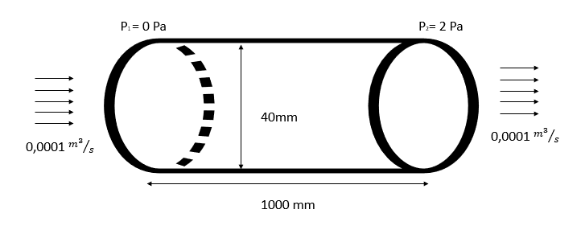
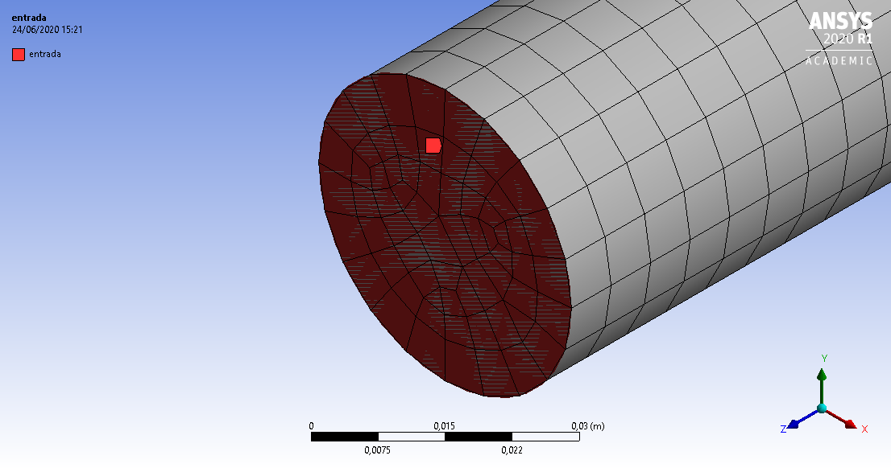
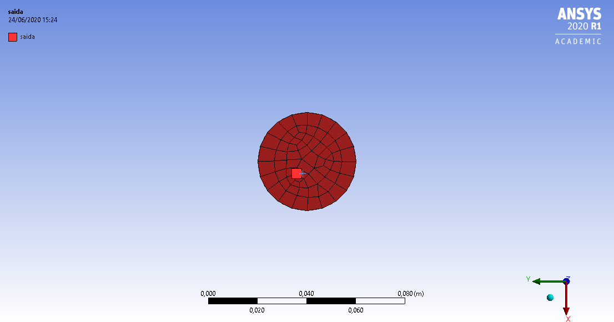
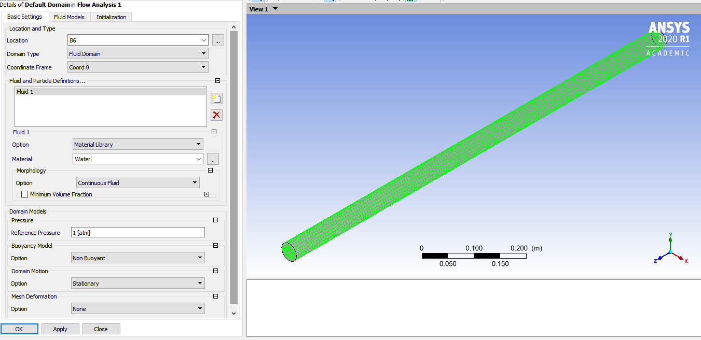
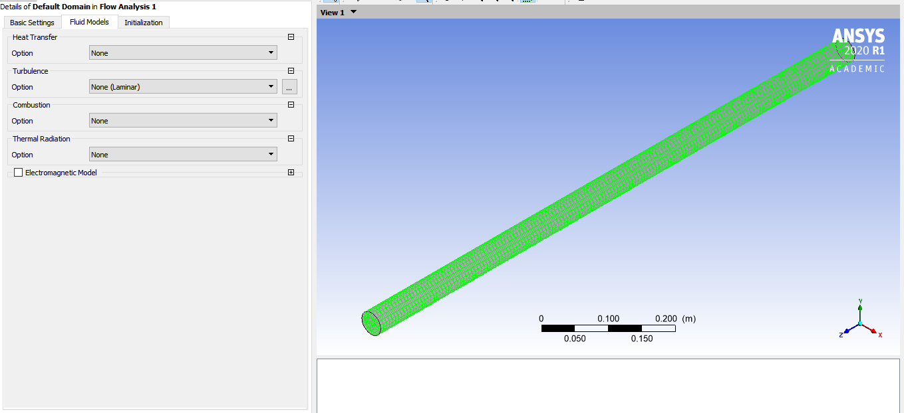
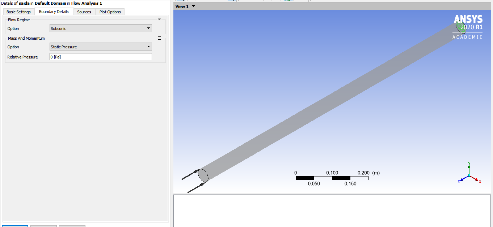
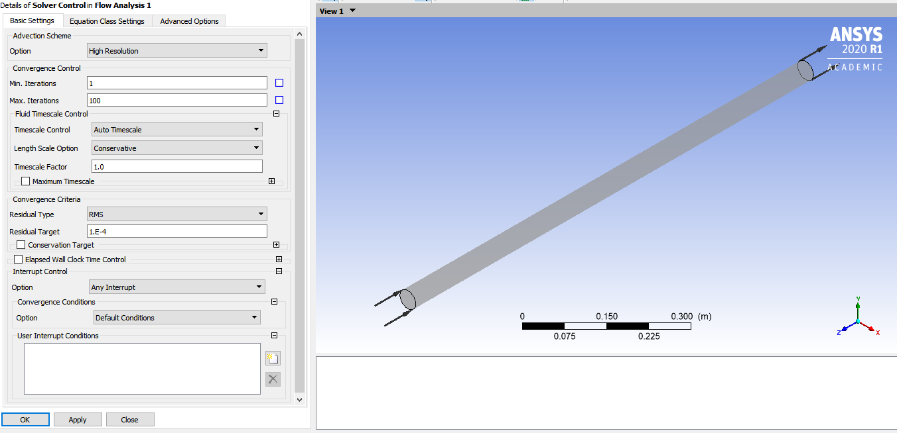
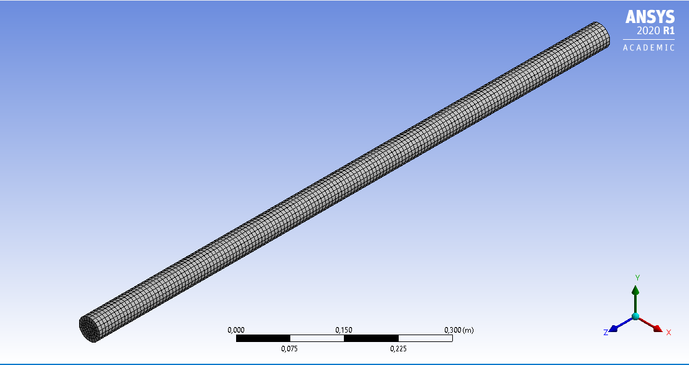
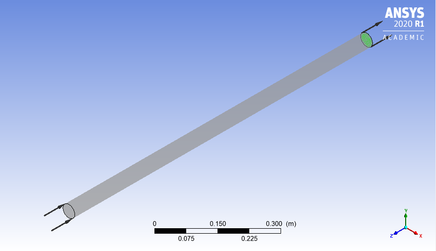

# Ludmilla Oliveira---16/0013348

Problema 1 - substituir a nota do laboratório

Problema 1: Uma instalação de bombeamento tem apresentado problemas em uma seção de tubulação de 1 metro de comprimento e 40 mm de diâmetro. A perda de carga foi medida usando sensores de pressão, e mensurou-se uma queda de pressão de 2 Pa. A bomba que supre esta tubulação com água está operando em potência máxima. Também mediu-se a vazão deste escoamento, obtendo um valor de 0,0001 metro cúbico por segundo na saída do tubo. O projeto de CFD deve:

- Determinar se estes valores de vazão e perda de carga estão coerentes ou não, e o motivo para isto.
- Apresentar possibilidades de problemas em caso dos valores colocados acima não estarem coerentes.
- Usando a simulação apresentada, realizar um estudo paramétrico do comprimento do tubo para avaliar se o cenário acima é normal ou não para esta instalação.

# Modelagem

## Perguntas

### Objetivo

O objetivo desse projeto é a análise da perda de carga em um cano de 40mm de diâmetro variando o seu comprimento, realizando assim comparações com cálculos feitos a partir da Equação de Bernoulli para a verificação da coerência dos dados obtidos via software.

#### Objetivos específicos 

Os objetivos específicos são a validação das informações apresentadas para vazão e perda de carga, e caso sejam incoerentes apresentar possibilidades para tal, e a partir da validação o prosseguimento para o objetivo geral. 

### Requisitos de solução

Para o problema proposto é a variação da perda de carga com o comprimento de um cano de 40mm de diâmetro, e caso não seja possivel a análise que seja indicado o meio para que ela seja feita.

### Finalidade do projeto

O projeto possui uma finalidade industrial, a qual é contituida pela avaliação da perda de carga de um cano, de acordo com a mudança do seu tamanho e a verificação da veracidade dos resultados obtidos 

### Possíveis hipóteses de simplificação

Uma hipotése que pode ser considerada é a de que a pressão relativa na entrada do cano seja igual a 0 Pa, o que facilitaria os cálculos para a verificação da perda de carga de 2 Pa. Outras possíveis siplificações são:

- Não existencia de flanges 
- Possui expessura regular  
- É composto somente por um material 

### Hipóteses de simplificação necessárias

Para uma melhor decorrência do projeto é necessário que sejam consideradas que o escoamento seja laminar e que não haja troca de calor com o meio, ou seja, esteja em um ambiente isolado 

### Precisão dos resultados obtidos

A precisão dos resultados seria de 3 casas decimais para ser possível cálculos precisos de forma análitica também

### Prazo de entrega do projeto

O prazo estipulado inicialmente é de 40 dias, sendo eles descriminados da seguinte forma 

- 10 dias para a modelagem 
- 15 dias para o pré-processamento 
- 15 dias para o processamento e pós-processamento

### Metodologias possíveis para o desenvolvimento do projeto

Para o caso apresentado, a melhor metodologia para a solução do problema é o CFD, tendo em vista que essa metodologia combina técnicas de cálculo numérico e dinâmica dos fluidos para a resolução de problemas de análise de escoamento e suas possíveis váriaveis.

---

## Projeto/Imagens

### Geometria do projeto

Figura 1 - imagem da base do cano com 40mm de diâmetro

 
Figura 2 - imagem do cano em seu comprimento, com 1m

### Esquemático da modelagem

Figura 3 - representação esquemática do problema 

# Pré processamento

---

## Perguntas

### Detalhamento do domínio dos cálculos

O detalhamento dos cálculos será mínimo, tendo em vista a simplicidade da geometria  e para o objeto de análise, a diferença de pressão, o qual será calculado de forma análitica por meio de uma das soluções da equação de Navier-Stokes apresentada abaixo.
$$
\Delta p = 32\frac{L}{D}\frac{\mu \bar{V}}{D}
$$
A modelagem feita para a solução da equação de Navier-Stokes considera um escoamento laminar plenamente desenvolvido, e tal situação se encaixa nas simplificações já estabelecidas anteriormente na modelagem do problema. 

### Adequação da geometria

Sim, considerando as hipoteses de simplificação já apresentadas, a geometria proposta se adequa as necessidades do problema tendo em vista a consideração de uma tubulação simples 

### Tipo de malha ( estruturada ou não estruturada, volumes finitos ou infinitos)

Para o problema analisado foi utilizada uma malha estruturada, produzida a partir do generate tendo como caracteristica ser hexagonal simples, essa malha é adequada ao projeto tendo em vista sua simplicidade geométrica; Foram considerados volumes finitos, os quais são mais adequados para a análise de fluidos. 

### Informações de entrada do problema

Na entrada do tudo dado temos as seguintes informações 

- Raio = 0,02m
- Velocidade = 0,0796 m/s, determindo de acordo com a seguinte equação

$$
V = \frac{Q_{a}}{A}
$$

      sendo que 

$$
Q_{a}
$$  - vazão volumétrica 

### Escolhas a serem feitas sobre o processamento das soluções

Serão determinados como parâmetros os seguintes tópicos 

1. água como fluido que irá percorrer o tubo 
2. escoamento laminar 
3. número de iterações variando entre 1 e 100 

### Prazos e disponibilidade da capacidade computacional

Dadas as atividades necessárias nessa etapa e a capacidade computacional disponível, é recomendado um prazo de 15 dias para o cumprimento e revisão das atividades realizadas 

---

## Projeto

### Descrição do pré processamento

Nessa etapa do projeto são atualizadas as etapas de 'Mesh' e 'Setup' da árvore de trabalho do CFX.

Na etapa do Mesh são realizados dois processos importantes para a simulação do projeto, enumerados abaixo: 

1. Foi gerada a malha automática, que é feita a partir do botão Generate, é uma malha hexagonal simples, porém que se adequa bem ao problema dada sua baixa complexidade 
2. Como último processo dessa etapa estão as seleções das entradas e saídas na geometria do tubo

    

    

Antes do prosseguimento para a etapa do Setup é necessária a atualização da malha, para que a malha crua gerada no Mesh possa ser lida pelo pré processador do CFX. 

Já na etapa de Setup, são definidos os parâmetros que são utilizados nos cálculos do problema posteriormente. O processo utilizado para a determinação dos parâmetros é enumerado abaixo 

1. Na opção Default Domain, encontrada na árvore de trabalho lateral, são realizados dois processos 
    1. Na aba de Basics settins, é escolhida a água como um fluido para a análise do problema e da pressão de referência como sendo 1 atm

        

    2. Na aba de Fluid Models, são escolhidas as condições gerais, onde se é selecionado um modelo onde não há a transferência de calor e o escoamento como sendo laminar 

        

2. No botão Boundary, são inseridos os limites de entrada e saída, a partir das opções geradas na árvore de trabalho são definidas as caracteristicas dos Boundaries inseridos 
    1. Na entrada, são definidos o tipo como sendo Inlet e a velocidade de entrada 

        

    2. Na saída, são definidos como o tipo Outlet e a pressão como sendo estática  

        

3. E na opção Solver Control, são mantidas as opções padrões já oferecidas pelo problema 

    

### Imagens de malha e cálculo do problema

